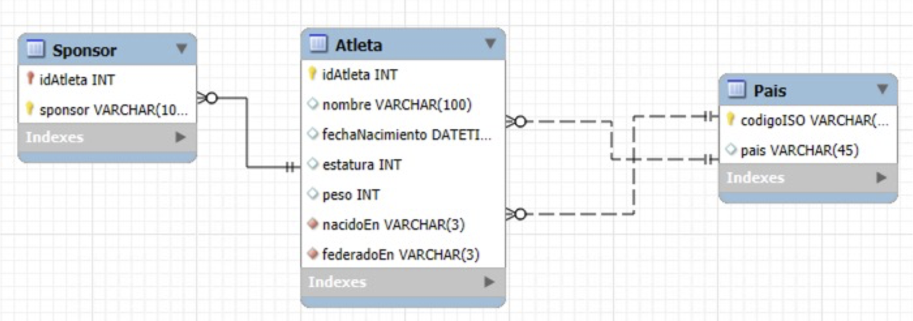

= Bases de datos para Ciencia de datos - Arquitecturas de datos. Datos estructurados y no estructurados
Máster de Formación permanente en Ciencia de Datos y Matemática computacional. Universidad de Almería - Manuel Torres <mtorres@ual.es>
////
NO CAMBIAR!!
Codificación, idioma, tabla de contenidos, tipo de documento
////
:encoding: utf-8
:lang: es
:toc: right
:toc-title: Tabla de contenidos
:doctype: book
:linkattrs:

// NO CAMBIAR!! (Entrar en modo no numerado de apartados)
:numbered!: 

////
COLOCA A CONTINUACION EL RESUMEN
////
[abstract,window="_blank"]
== Resumen
En este capítulo se exploran las arquitecturas de datos fundamentales para la Ciencia de Datos, centrándose en la clasificación de los datos en estructurados, semiestructurados y no estructurados. Se analizan las características, usos y desafíos asociados a cada tipo de datos, así como las herramientas y tecnologías empleadas para su gestión. Además, se introduce el concepto de Sistemas de Gestión de Bases de Datos (DBMS) y el modelo relacional, destacando la importancia de las claves primarias y ajenas en la organización y relación de los datos. Este conocimiento es esencial para diseñar arquitecturas de datos eficientes que soporten las necesidades analíticas en proyectos de Ciencia de Datos.

////
COLOCA A CONTINUACION LOS OBJETIVOS
////
.Objetivos
* Comprender la importancia de los datos en la Ciencia de Datos y su rol fundamental en las arquitecturas de datos.
* Diferenciar entre datos estructurados, semiestructurados y no estructurados, identificando sus características, usos y desafíos.
* Conocer las herramientas y lenguajes asociados a cada tipo de datos.
* Introducir el concepto de Sistemas de Gestión de Bases de Datos (DBMS) y su función en la gestión de datos.
* Familiarizarse con el modelo relacional y las claves primarias y ajenas como mecanismos esenciales para la organización y relación de los datos.

// Entrar en modo numerado de apartados
:numbered:

[[introduccion]]
== Rol Fundamental de los Datos en Ciencia de Datos

El pilar de cualquier estrategia de Ciencia de Datos es contar con una arquitectura sólida capaz de gestionar de manera efectiva la Variedad, el Volumen y la Velocidad de la información. Comprender los tipos de datos es el primer paso para construir dicha arquitectura.

[[seccion_1_tipos]]
== Datos estructurados, semi-estructurados y no estructurados

La forma en que se organiza y almacena la información determina cómo se puede procesar y analizar. A continuación, se detallan las características, usos y retos de los tres tipos principales de datos.

=== Datos estructurados

Los datos estructurados son la forma más tradicional y organizada de información, siendo la base para muchos análisis de negocio.

==== Características principales

*   Son datos altamente organizados.
*   Se ajustan a un modelo de datos predefinido que sigue un esquema rígido.
*   El modelo relacional es el más popular y extendido para su gestión.
*   Se presentan en un formato tabular, compuesto por filas y columnas.
*   En este formato tabular, las filas representan las entidades u objetos de la realidad, mientras que las columnas representan sus propiedades o características.
*   Son relativamente fáciles de buscar, consultar y analizar mediante lenguajes específicos. A estos lenguajes se les denomina Lenguajes de Definición y Manipulación de Datos (DDL y DML). Un ejemplo destacado es el SQL (Structured Query Language).

==== Herramientas y lenguajes

Para la gestión de datos estructurados, se utilizan herramientas y lenguajes estandarizados:

*   RDMBS (Relational Database Management Systems): Sistemas como MySQL, SQL Server, PostgreSQL u Oracle. Se utilizan para almacenar, gestionar y consultar datos estructurados.
*   SQL (Structured Query Language): Este es el lenguaje estándar y universal diseñado específicamente para definir y manipular datos estructurados.
*   Hojas de cálculo: Representan la forma más básica y común de datos estructurados para los usuarios de negocio, incluyendo herramientas como Microsoft Excel y Google Sheets.

==== Ejemplos Comunes

Los datos estructurados incluyen registros de negocio y financieros, tales como:

*   Clientes y Productos.
*   Cuentas corrientes y Transacciones bancarias.
*   Tarjetas de crédito y Préstamos hipotecarios.
*   Ensayos clínicos.
*   Pólizas de seguros y Siniestros de una póliza de seguros.

=== Datos no estructurados

Los datos no estructurados son aquellos que carecen de un modelo de datos predefinido y representan la mayor parte de la información generada en la actualidad.

==== Características principales

*   No tienen un modelo de datos predefinido.
*   Se almacenan generalmente en su formato nativo.
*   Resultan difíciles de procesar y analizar si no se aplica un procesamiento previo.

==== Ejemplos comunes

Estos datos abarcan archivos de texto y contenido multimedia:

*   Correos electrónicos y archivos PDF.
*   Documentos de texto.
*   Publicaciones en redes sociales.
*   Archivos multimedia (sonido, video, imágenes).

==== Retos del procesamiento y almacenamiento

Los datos no estructurados presentan desafíos significativos en cuanto a almacenamiento y procesamiento:

*   Almacenamiento y coste:

    ** Crecimiento: Presentan un crecimiento exponencial, a menudo enmarcados dentro del concepto de Big Data.
    ** Espacio: Requieren mucho más espacio de almacenamiento en comparación con los datos estructurados.
    ** Sistemas: Exigen la necesidad de implementar sistemas de archivos distribuidos o almacenamiento de objetos para mantener un coste asumible.

*   Procesamiento y tecnología:

    ** Complejidad: Su naturaleza impide el uso de consultas SQL simples.
    ** Preprocesamiento: Requieren la aplicación de técnicas avanzadas de preprocesamiento.
    ** Tecnología (IA): Necesitan el uso de Inteligencia Artificial (IA), específicamente el Procesamiento de Lenguaje Natural y la Visión por computador.

=== Datos semiestructurados

Los datos semiestructurados actúan como un punto intermedio, ofreciendo una estructura flexible que utiliza etiquetas para la organización.

==== Características principales

*   Se consideran un puente entre los dos mundos (estructurado y no estructurado).
*   A diferencia del modelo relacional, no poseen un esquema rígido de tipo tabular.
*   Utilizan etiquetas para organizar y delimitar la información.
*   La organización es jerárquica, lo que implica que los datos están anidados.

==== Formatos comunes

Los formatos más utilizados en este ámbito son:

*   JSON (JavaScript Object Notation): Es un formato muy usado en APIs y aplicaciones web. A continuación, un ejemplo sencillo de un objeto JSON que representa a una persona:
+
```json
{
    "nombre": "Juan Pérez",
    "edad": 30,
    "direccion": {
        "calle": "Calle Falsa 123",
        "ciudad": "Madrid",
        "pais": "España"
    },
    "telefonos": ["+34 600 123 456", "+34 600 654 321"]
}
```
*   XML (eXtensible Markup Language): Considerado el predecesor de JSON. Se emplea en diversas aplicaciones, incluyendo servicios web y configuraciones. A continuación, un ejemplo sencillo de un documento XML que representa a una persona:
+
```xml
<persona>
    <nombre>Juan Pérez</nombre>
    <edad>30</edad>
    <direccion>
        <calle>Calle Falsa 123</calle>
        <ciudad>Madrid</ciudad>
        <pais>España</pais>
    </direccion>
    <telefonos>
        <telefono>+34 600 123 456</telefono>
        <telefono>+34 600 654 321</telefono>
    </telefonos>
</persona>
```

Como se observa en los ejemplos, ambos formatos permiten representar datos de manera jerárquica y flexible, facilitando el intercambio de información entre sistemas diversos. Se observa también que JSON tiende a ser más conciso y legible para los humanos, mientras que XML es más verboso. Sin embargo, XML ofrece una mayor capacidad de definición de estructuras complejas mediante el uso de esquemas.

=== Comparativa de tipos de datos

La siguiente tabla resume las diferencias clave entre los tres tipos de datos:

|===
| Característica | Datos estructurados | Datos semiestructurados | Datos no estructurados

| **Modelo de datos**
| Predefinido y rígido – Definido a priori
| No definido y flexible – Definido sobre la marcha
| No definido y flexible – Definido sobre la marcha

| **Usos**
| Almacenamiento de datos alfanuméricos
| Almacenamiento de datos alfanuméricos
| Almacenamiento de datos binarios (sonido, video, imágenes) y texto libre

| **Facilidad de búsqueda**
| Alta (mediante consultas simples)
| Alta (mediante consultas no siempre simples)
| Baja

| **Herramientas**
| RDBMS (Relational Database Management Systems)
| NoSQL
| Hadoop, Data Lakes, IA
|===

[[seccion_2_dbms]]
== DBMS, Modelos de datos y claves

La gestión efectiva de la información se logra a través de los Sistemas de Gestión de Bases de Datos (DBMS) y la aplicación de modelos de datos específicos.

=== El Sistema de Gestión de Bases de Datos (DBMS)

Los datos son gestionados por un DBMS (Database Management System), el cual es un software con funciones clave:

*   Definición de la base de datos: Ofrece el DDL (Data Definition Language).
*   Construcción de la base de datos: Se encarga de la gestión del almacenamiento físico de los datos.
*   Manipulación de la base de datos: Ofrece el DML (Data Manipulation Language).

=== Modelo relacional

Un modelo de datos es una notación utilizada para describir y organizar los datos. El modelo relacional es el más extendido en la actualidad.

*   Organización: Organiza los datos en tablas.
*   Filas: Representan las entidades u objetos de la realidad.
*   Columnas: Se utilizan para especificar las propiedades o características de dichas entidades.

=== Claves

Las claves son mecanismos esenciales dentro del modelo relacional para garantizar la unicidad e integridad de la información.



==== Clave primaria (Primary Key)

*   Es una columna o un conjunto de columnas cuya función es identificar de forma única a una fila específica dentro de una tabla.
*   Ejemplos: `idAtleta` en la tabla `Atleta`, `codigoISO` en la tabla `País`.

==== Clave ajena (Foreign Key)

*   Es una columna o un conjunto de columnas que reside en una tabla y hace referencia a una clave primaria (generalmente situada en otra tabla).
*   Establecen la relación entre las entidades.
*   Ejemplo: La clave ajena `nacidoEn` en la tabla `Atleta` hace referencia a la clave primaria `codigoISO` en la tabla `País`.

## Licencia

Licencia CC BY-NC-ND 4.0

Copyright (c) 2025 [Manuel Torres - Departamento de Informática - Universidad de Almería]

Este proyecto está licenciado bajo la Licencia CC BY-NC-ND 4.0. Esto significa que puedes compartir el proyecto siempre que cites al autor, no lo uses para fines comerciales y no realices obras derivadas.