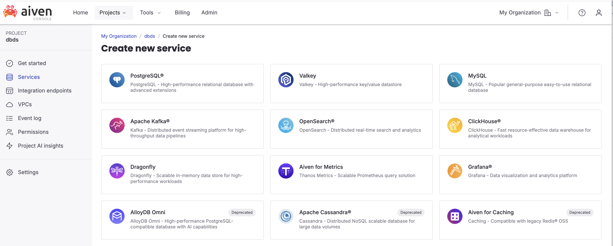
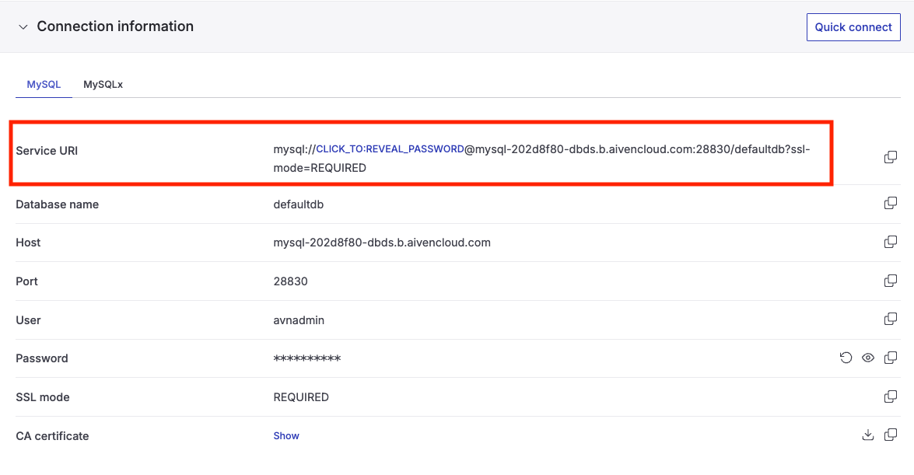

= Bases de datos para Ciencia de datos - Entorno de trabajo
Máster de Formación permanente en Ciencia de Datos y Matemática computacional. Universidad de Almería - Manuel Torres <mtorres@ual.es>
////
NO CAMBIAR!!
Codificación, idioma, tabla de contenidos, tipo de documento
////
:encoding: utf-8
:lang: es
:toc: right
:toc-title: Tabla de contenidos
:doctype: book
:linkattrs:

// NO CAMBIAR!! (Entrar en modo no numerado de apartados)
:numbered!: 

////
COLOCA A CONTINUACION EL RESUMEN
////
[abstract,window="_blank"]
== Resumen
El entorno de trabajo para este curso se basa en Jupyter Notebooks y un servidor de bases de datos MySQL. Jupyter Notebooks es una herramienta interactiva que permite combinar código, texto y visualizaciones en un solo documento, facilitando el aprendizaje práctico. MySQL es un sistema gestor de bases de datos relacional ampliamente utilizado que soporta SQL, el lenguaje estándar para la gestión y manipulación de bases de datos. En este tutorial, se describen los pasos necesarios para configurar este entorno, incluyendo la instalación de Jupyter y las extensiones necesarias para ejecutar SQL, así como la configuración de un servidor MySQL, ya sea localmente o mediante un servicio en la nube como Aiven.

////
COLOCA A CONTINUACION LOS OBJETIVOS
////
.Objetivos
* Configurar un entorno de trabajo basado en Jupyter Notebooks y MySQL.
* Crear una instancia de MySQL en Aiven.
* Conectar Jupyter Notebooks a un servidor de bases de datos MySQL.


// Entrar en modo numerado de apartados
:numbered:

== Introducción

Para el desarrollo práctico de este módulo usaremos un entorno de trabajo basado en Jupyter Notebooks y un servidor de bases de datos. El servidor de bases de datos podría ser cualquier sistema gestor de bases de datos relacional (RDBMS) que soporte SQL, como PostgreSQL, SQLite, Oracle, SQL Server,
pero en este módulo usaremos MySQL.

Por otro lado, Jupyter Notebooks es un entorno de trabajo interactivo que permite combinar código ejecutable, texto enriquecido, ecuaciones matemáticas, visualizaciones e imágenes en un único documento. Este entorno es muy útil para la enseñanza y el aprendizaje, ya que permite a los estudiantes experimentar con el código y ver los resultados de inmediato. Para usar Jupyter Notebooks con SQL, utilizaremos la extensión `Jupyter-SQL`, que permite ejecutar consultas SQL directamente desde las celdas del notebook, y `PyMySQL`, que es un conector de Python para MySQL.

## Configuración del entorno de trabajo

Para preparar el entorno de trabajo, sigue estos pasos.

### Configuración del servidor de bases de datos MySQL

Para el desarrollo de las prácticas, puedes instalar MySQL en tu máquina local o usar un servicio de bases de datos en la nube. 

Si decides instalar MySQL localmente, puedes descargarlo desde la página oficial de https://dev.mysql.com/downloads/mysql/[MySQL]: Sigue las instrucciones de instalación para tu sistema operativo. Durante la instalación, asegúrate de configurar una contraseña segura para el usuario `root`. También puedes crear un usuario específico para este curso con los permisos necesarios para crear y manipular bases de datos. 

Si prefieres usar un servicio en la nube, hay varias opciones disponibles, como Amazon RDS, Google Cloud SQL o Azure Database for MySQL. Estos servicios suelen ofrecer planes gratuitos con ciertas limitaciones que pueden ser suficientes para el desarrollo de las prácticas. Para el curso, se recomienda usar el servicio gratuito de bases de datos https://www.aiven.io[Aiven]. Aiven es una plataforma que ofrece servicios gestionados  en la nube, principalmente para bases de datos y tecnologías de streaming. Puedes registrarte en Aiven y crear una instancia gratuita de MySQL siguiendo las instrucciones en su sitio web.

Para crear una instancia gratuita de MySQL en Aiven:

1. Regístrate en Aiven: https://www.aiven.io[Crea una cuenta] si no tienes una.
2. Crea un proyecto (p.e. `dbds`, de _Databases for Data Science_): Una vez que hayas iniciado sesión, crea un nuevo proyecto desde el panel de control. Los proyectos te permiten organizar tus servicios.
+

3. Crea una instancia de MySQL: Desde el proyecto, seleccionar `Services` en el menú lateral y selecccionar el servicio `MySQL` en la sección `Create new service`. Configurar los detalles de la instancia, como el nombre, la región y el plan. Asegúrate de seleccionar el plan gratuito. En nuestro caso, seleccionaremos:
    - Service tier: `Free`
    - Cloud: `Europe`
    - Plan: `Free-1-gb`
    - Service name: Dejaremos el nombre predeterminado

Tras crear la instancia, Aiven te proporcionará los detalles de conexión, como el host, el puerto, el nombre de usuario y la contraseña. También proporciona la cadena de conexión completa (URI) que puedes usar para conectarte a la base de datos desde Jupyter Notebooks. Guarda esta información, ya que la necesitarás para conectarte a la base de datos desde Jupyter Notebooks.



### Configuración de Jupyter Notebooks

Para usar Jupyter Notebooks con SQL, necesitas instalar Jupyter y las extensiones necesarias. Puedes hacerlo usando `pip`, el gestor de paquetes de Python. Abre una terminal y ejecuta los siguientes comandos:

```bash
pip install jupyter <1>
pip install jupysql <2>
pip install PyMySQL <3>
```
<1> Jupyter Notebook
<2> Extensión para ejecutar SQL en Jupyter Notebooks
<3> Conector de Python para MySQL


Una vez que hayas instalado Jupyter y las extensiones necesarias, puedes iniciar Jupyter Notebooks ejecutando el siguiente comando en la terminal:

```bash
jupyter notebook
```

Esto abrirá Jupyter Notebooks en tu navegador web. En la sección siguiente se muestra cómo descargar los notebooks del curso y comenzar a trabajar con ellos.

### MySQL Workbench (opcional)

MySQL Workbench es una herramienta visual para diseñar, modelar, generar y gestionar bases de datos MySQL. Aunque no es estrictamente necesario para este curso, puede ser útil para visualizar y gestionar la base de datos de manera más intuitiva. Además, cuenta con herramientas de modelado y de ingeniería inversa que permiten crear diagramas entidad-relación (ER) a partir de una base de datos existente. Puedes https://dev.mysql.com/downloads/workbench/[descargar MySQL Workbench desde la página oficial].

En MySQL Workbench, puedes conectarte a tu instancia de MySQL en Aiven utilizando los detalles de conexión proporcionados anteriormente. Una vez conectado, puedes explorar las bases de datos, ejecutar consultas SQL y utilizar las herramientas de modelado para crear diagramas ER. MySQL Workbench permite exportar los diagramas ER en varios formatos, como PDF o imágenes, lo que puede ser útil para documentar el diseño de la base de datos.

Además, en este curso se proporcionan modelos de bases de datos en formato `.mwb` (MySQL Workbench) que puedes abrir directamente en MySQL Workbench para visualizar y modificar los diagramas ER. Asimismo, se proporcionan scripts de inicialización para varias bases de datos de ejemplo. Puedes usar MySQL Workbench para ejecutar estos scripts y crear las bases de datos en tu instancia de MySQL. Luego, puedes utilizar Jupyter Notebooks para realizar consultas SQL y analizar los datos en estas bases de datos.

## Descarga de los notebooks del curso

Los notebooks del curso están disponibles en el repositorio de GitHub del curso. Puedes clonar el repositorio usando `git` o descargar los archivos directamente desde la página web del repositorio.

Para clonar el repositorio, abre una terminal y ejecuta el siguiente comando:

```bash
git clone https://github.com/tu_usuario/tu_repositorio.git
```

Si prefieres descargar los archivos directamente, ve a la página del repositorio en GitHub, haz clic en el botón `Code` y selecciona `Download ZIP`. Luego, descomprime el archivo ZIP en tu máquina local. Una vez que hayas clonado o descargado el repositorio, sobre el directorio del repositorio, lanza Jupyter Notebooks y abre los notebooks del curso para comenzar a trabajar con ellos.

## Licencia

Licencia CC BY-NC-ND 4.0

Copyright (c) 2025 [Manuel Torres - Departamento de Informática - Universidad de Almería]

Este proyecto está licenciado bajo la Licencia CC BY-NC-ND 4.0. Esto significa que puedes compartir el proyecto siempre que cites al autor, no lo uses para fines comerciales y no realices obras derivadas.